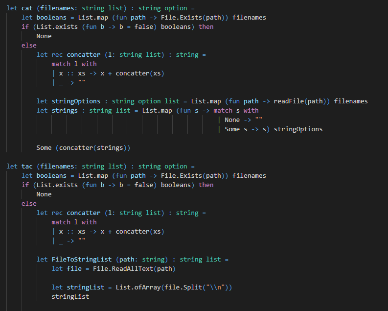

# Fsharp implementation of Linux Cat and Tac commands
I made a library for the Linux Cat and Tac commands in Fsharp including a fun experiment on webscraping with Fsharp, using mono's web tools.

## Cat
The Cat command is made to join strings from text files into larger strings.

## Tac
The Tac command also joins strings but from a list of txt files and reverses the list including every string.
